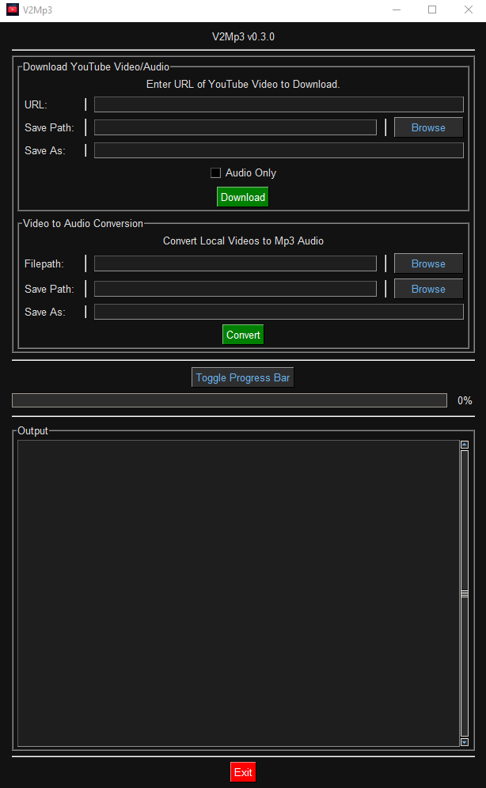

# V2Mp3


---

## About

**_`V2Mp3`_** is an easy-to-use compact video-to-audio conversion tool with built-in _**YouTube**_ video/audio download functionality.

- Convert locally stored video files _**([of any file-format supported by `ffmpeg`](https://ffmpeg.org/general.html#Video-Codecs))**_ to _**.mp3**_ audio.

  - A few of these formats include:
    - .aiff
    - .avi
    - .flv
    - .gif
    - .mov
    - .mpg
    - .mp4
    - .ogv
    - .qt
    - .wmv
    - many others.

- Download _**YouTube**_ videos as _**.mp4**_ files.

- Download _**YouTube**_ audio as _**.mp3**_ files.

---

## Installation

### Using pip

> _Easiest method of installation._
> **Highly recommended over manual installation.**

- Run the following to install V2Mp3 using `pip`:

  - ```shell
    pip install V2Mp3
    ```

- Once installed, you can quickly start V2Mp3 with the following command:

  - ```shell
    v2mp3
    ```

- You may also import/run _**`V2Mp3`**_ within your python environment like so:

  - ```python
    >>> from V2Mp3 import v2mp3
    >>> v2mp3() # open program window.
    ...
    ```

- Done!

---

### Manual Installation

> _Not recommended._

1. Start by doing _one of two things_:

   - _**A.**_ Download source code **\*.zip** archive from the V2Mp3 GitHub repo ["releases"](https://github.com/schlopp96/V2Mp3/releases/latest) tab, and extract the contents to your desired installation directory.

   - _**B.**_ Clone the repo with the git client of your choice by entering the following command:

     - ```shell
        git clone https://github.com/schlopp96/V2Mp3/releases/latest/
        ```

2. Navigate to directory containing extracted contents, and open said directory within a terminal.

3. Install all dependencies for this package using the following command:

   - ```shell
     pip install -r requirements.txt
     ```

4. **This step is OPTIONAL**
   - Move the _**`V2Mp3-vx.x.x`**_ directory to your global Python 3rd-party package installation directory to be able to import _**V2Mp3**_ like any other module:
     - `"path/to/python/Lib/site-packages/HERE"`

- You should now be able to import/run _**V2Mp3**_ within your python environment by entering the following:

  - ```python
    >>> from V2Mp3 import v2mp3
    >>> v2mp3() # open program window.
    ...
    ```

- Done!

---

## Usage

> Using _**`V2Mp3`**_ is generally straightforward, with directions and tooltips built in to the GUI describing what to do if you're confused.

- You can quickly start _**`V2Mp3`**_ using this simple CLI command:

  - ```shell
     v2mp3
    ```

- Other ways to start V2Mp3 include:

  - Entering `python -m V2Mp3` in a terminal.
  - Importing _**`V2Mp3`**_ in a python environment and calling _`V2Mp3.v2mp3()`_ from within that environment (as illustrated above).
  - Opening `"~/V2Mp3/main.pyw"` from a file explorer.

---

## Structure

### **First Containing Frame**

- Home to the _**YouTube**_ download section
- Enter your desired _**YouTube**_ video's URL address in the input field.
  - Also works with _**YouTube Music**_ addresses.
- Choose whether to download the video as normal, or just the audio from the video.
- Once ready, click the "**Download**" button to begin.
- You can find your downloaded videos within the _**V2Mp3**_ installation directory:
  - `"~/V2Mp3/downloads/videos"`

### **Second Containing Frame**

- Contains the section for conversion of your local video files.
- Use the "Browse" button to choose a video file you wish to convert to audio.
- Once you've chosen a video, click the "**Convert File**" button at the bottom of the first frame.
- The text output window at the bottom of the application window will display whether or not the conversion was successful.
- Newly converted .mp3 audio files can be found within the _**V2Mp3**_ installation directory:
  - `"~/V2Mp3/downloads/audio"`

### **Progress Bar**

- As of now, the progress bar is **NOT** functional.
- Users can toggle the visibility of the progress bar using the "Toggle Progress Bar" button and selecting the "ON" or "OFF" option.
- This toggle button will be temporary until the progress bar is fully functional.

### Quick Look at _**`V2Mp3`**_



---

## Coming Soon

- **\*.exe** program build so that a Python env isn't necessary to run **_V2Mp3_**.

---

## Contact

- If you have any questions, comments, or concerns that cannot be addressed through the [project's GitHub repository](https://github.com/schlopp96/V2Mp3), please feel free to contact me through my email address:

  - `schloppdaddy@gmail.com`

---
