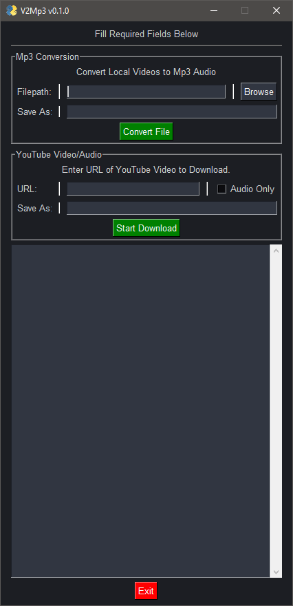

# V2Mp3

## About

**_`V2Mp3`_** is a simple, compact video-to-audio conversion tool with built-in _**YouTube**_ video/audio download functionality.

- Convert locally stored video files _**([of any file-format supported by `ffmpeg`](https://ffmpeg.org/general.html#Video-Codecs))**_ to _**.mp3**_ audio.

  - A few of these formats include:
    - .aiff
    - .avi
    - .flv
    - .gif
    - .mov
    - .mpg
    - .mp4
    - .ogv
    - .qt
    - .wmv
    - many others.

- Download _**YouTube**_ videos as _**.mp4**_ files.

- Download _**YouTube**_ audio as _**.mp3**_ files.

---

## Usage

### Using _**`V2Mp3`**_ is generally straightforward, with directions and tooltips built in to the GUI describing what to do if you're confused

---

### **First Containing Frame**

- Contains the section for conversion of your local video files.
- Use the "Browse" button to choose a video file you wish to convert to audio.
- Once you've chosen a video, click the "**Convert File**" button at the bottom of the first frame.
- The text output window at the bottom of the application window will display whether or not the conversion was successful.
- Newly converted .mp3 audio files can be found within the `"./audio"` folder, inside the _**V2Mp3**_ installation directory:
  - `"./path/to/V2Mp3/audio"`

### **Second Containing Frame**

- Home to the _**YouTube**_ download section
- Enter your desired _**YouTube**_ video's URL address in the input field.
  - Also works with _**YouTube Music**_ addresses.
- Choose whether to download the video as normal, or just the audio from the video.
- Once ready, click the "**Download**" button to begin.
- You can find your downloaded videos within the `"./video"` folder, inside the _**V2Mp3**_ installation directory:
  - `"./path/to/V2Mp3/video"`

### Quick Look at _**`V2Mp3`**_



---

## Installation

### Using pip

> _Easiest_ method. Highly recommended over manual installation.

- Run the following to install using `pip`:

```python
pip install V2Mp3
```

- You should now be able to import/run _**`V2Mp3`**_ within your python environment by entering the following:

```python
>>> from V2Mp3 import v2mp3
>>> v2mp3() # open program window.
...
```

- That's it!

---

### Manual Installation

> _Not_ recommended.

1. Download source code **zip archive** from the [V2Mp3 GitHub repository's](https://github.com/schlopp96/V2Mp3) "_**Releases**_" tab.

2. Extract contents from containing `.zip` archive somewhere you can still access it (for now).

3. Navigate to directory containing extracted contents, and open said folder within a terminal.

4. Enter `pip install -r requirements.txt` to install all dependency requirements for this package.

5. Finally, move the `"V2Mp3-vx.x.x\V2Mp3"` directory to your global Python 3rd-party package installation directory to be able to import _**`V2Mp3`**_ like any other module:

   - `"path/to/python/Lib/site-packages/HERE"`

6. You should now be able to import/run _**`V2Mp3`**_ within your python environment by entering the following:

```python
>>> from V2Mp3 import v2mp3
>>> v2mp3() # open program window.
...
```

- That's it!

---

## Contact

- If you have any questions, comments, or concerns that cannot be addressed through the [project's GitHub repository](https://github.com/schlopp96/V2Mp3), please feel free to contact me through my email address:

  - `schloppdaddy@gmail.com`

---
